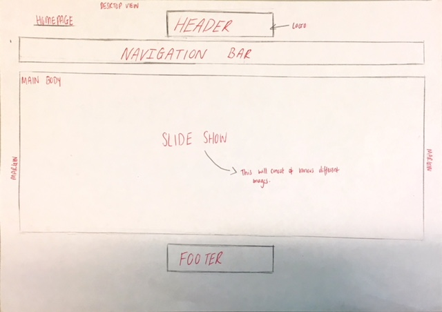
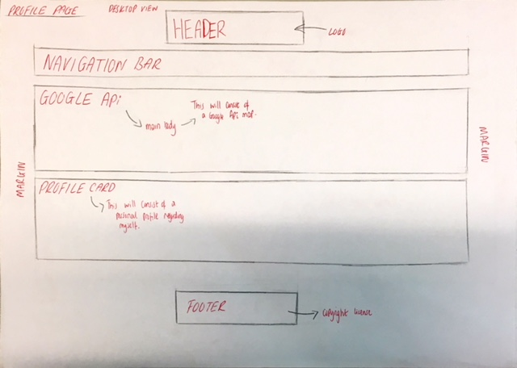
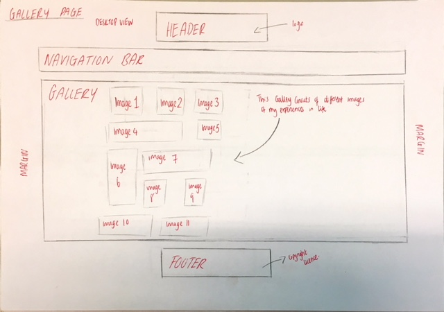

<h1> CTEC3905 FRONT END DEVLOPEMENT P15243181 <h1>

<h2> Project outline <h2>

For this second assignment I was delegated the task of creating a website of my own preference where I decided I will create a website upon myself and my experiences through- out the years. The reason why I chose this theme was because all my previous website projects have been about something fiction and so this time I wanted it to be something personal and interesting. The website consists of html 5 elements, css and JavaScript. The website is aimed at everyone who is interesting knowing about my personal life and can do so. The website consists of three pages: home, profile and a gallery. Quite simply the website has a simple navigation architecture and the user can locate itself page by page via the navigation bar.

<h2>
<h2> wireframes <h2>
 
 
 
 