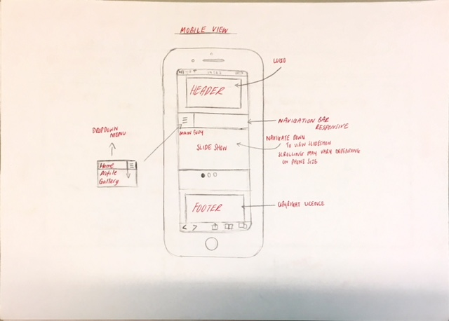

<h1> CTEC3905 FRONT END DEVLOPEMENT P15243181 <h1>

<h2> Project outline <h2>

For this second assignment I was delegated the task of creating a website of my own preference where I decided I will create a website upon myself and my experiences through- out the years. The reason why I chose this theme was because all my previous website projects have been about something fiction and so this time I wanted it to be something personal and interesting. The website consists of html 5 elements, css and JavaScript. The website is aimed at everyone who is interesting knowing about my personal life and can do so. The website consists of three pages: home, profile and a gallery. Quite simply the website has a simple navigation architecture and the user can locate itself page by page via the navigation bar.

<h2> intial ideas <h2>

 At the start I had planned my website out using a prototype created on PowerPoint, which then I implemented. Once this was implemented I had changed my mind due to not designing enough content. I still pushed this through my repository however I then began re designing and re developed my project. I then initiated another prototype by rough sketches which can be seen below.

<h2> wireframes <h2>
 
 
 
 

<h2> Development Process <h2>

In the developmental process it was as learning curve with many aspects self -learnt and embedded into my final website also using code from the learnt lab sessions. This consisted of using correct html5 semantic mark-up, CSS and JavaScript. My website consists of all the mentioned languages. The theme of my website was subtle colours where I tried to keep a consistency of fonts and colours. The colour scheme of my website was kept in line with my profile card which was dusty pink.

<h2> issues solved <h2>

At the beginning with my early design, the navigation bar was only responsive and the rest of the content was not responsive. Not only this but on desktop view and different screen sizes the content was not fixed and would be out of place. To fix this issue I was advised by my tutor to use percentages instead of pixels. This was still a struggle. So, I decided to re design my pages.

Images were not loading on the home slide show and the gallery on the gallery page was not displaying the images. I then figured out I had made quite a simple error whereby the file path was named in correctly. The folder was named after ‘images’ however the file path was looking for ‘Images’. Due to the file path incorrectly inserted, we were able to rectify this issue quite easily.
