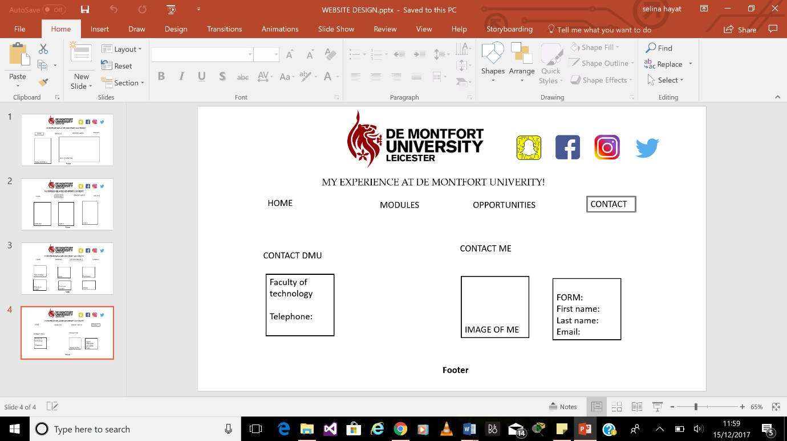

<h1> CTEC3905 FRONT END DEVLOPEMENT P15243181 <h1>

<h2> Project outline <h2>

For this second assignment I was delegated the task of creating a website of my own preference where I decided I will create a website upon myself and my experiences through- out the years. The reason why I chose this theme was because all my previous website projects have been about something fiction and so this time I wanted it to be something personal and interesting. The website consists of html 5 elements, css and JavaScript. The website is aimed at everyone who is interesting knowing about my personal life and can do so. The website consists of three pages: home, profile and a gallery. Quite simply the website has a simple navigation architecture and the user can locate itself page by page via the navigation bar.

<h2> intial ideas <h2>

 At the start I had planned my website out using a prototype created on PowerPoint, which then I implemented. Once this was implemented I had changed my mind due to not designing enough content. I still pushed this through my repository however I then began re designing and re developed my project. I then initiated another prototype by rough sketches which can be seen below.

<h2> wireframes <h2>

 The following screenshots were designed on PowerPoint for my first designs. I then decided to re design my website due to looking dull.

 
 
 
 

The following hand drawn wire frames were then re designed and implemented.

 
 
 

<h2> Development Process <h2>

In the developmental process it was as learning curve with many aspects self -learnt and embedded into my final website also using code from the learnt lab sessions. This consisted of using correct html5 semantic mark-up, CSS and JavaScript. My website consists of all the mentioned languages. The theme of my website was subtle colours where I tried to keep a consistency of fonts and colours. The colour scheme of my website was kept in line with my profile card which was dusty pink, in coordination with my bitmoji (personal character). At the very beginning I began developing the navigation bar and then decided to make the webpage responsive in three different modes: desktop view, mobile view and tablet mode. From the following screenshot you are able to see my finalised website is responsive in the 3 different modes.

 

 Mobile View

 

 Tablet View

 

 Desktop View

 

<h2> Issues solved <h2>

At the beginning with my early design, the navigation bar was only responsive and the rest of the content was not responsive. Not only this but on desktop view and different screen sizes the content was not fixed and would be out of place. To fix this issue I was advised by my tutor to use percentages instead of pixels. This was still a struggle. So, I decided to re design my pages.

Images were not loading on the home slide show and the gallery on the gallery page was not displaying the images. I then figured out I had made quite a simple error whereby the file path was named in correctly. The folder was named after ‘images’ however the file path was looking for ‘Images’. Due to the file path incorrectly inserted, we were able to rectify this issue quite easily.

<h2> Validation </h2>

 The pages were inserted into the validator and there were a few silly mistakes which I was able to fix quite quickly. Another silly error made was I forgot to add the <!DOCTYPE html> into the html5 file so that was displaying an error. The rest of the code was error free.

<h2> Homepage validation </h2>
 

 I put the first page through the validator and there were no errors. This was good as I did not have to fix anything.

<h2> Contact Validation</h2>
 

 I then validated the second page and once again there were no errors.

<h2> Gallery Validation </h2>
 

 Finally, I validated the final page and there was one error which was quite a silly mistake and I was able to rectify this myself.

<h2> Navigation plan </h2>
 

 As you can see from the navigation architecture is the basic architecture for my website.

<h2> User Testing </h2>

 I had a few members from my group test out my website and they stated it was nicely designed. They were able to view it from their desktop, in tablet mode, and mobile mode. When they rotated their screens on the mobile view and tablet view the website was all responsive.

<h2>References</h2>

CodePen.  040 - Gallery (CSS animated). available from https://codepen.io/roydigerhund/pen/VaPKvj?q=gallery+css&limit=all&type=type-pens  accessed 12 December 2017 

CodePen. Pure CSS Social Media Icons. available from https://codepen.io/Deadlymuffin/pen/hGiqo/  accessed 12 December 2017

W3schools.com How To Create a Responsive Top Navigation Menu available from  https://www.w3schools.com/howto/howto_js_topnav_responsive.asp  accessed  20 Nov 2017 

W3schools.com. W3.CSS Slideshow. available from https://www.w3schools.com/w3css/w3css_slideshow.asp  accessed 12 December 2017

W3schools.com. HTML Color Names. Available from https://www.w3schools.com/colors/colors_names.asp  accessed 12 December 2017

W3schools.com. HTML Color Picker. available from https://www.w3schools.com/colors/colors_picker.asp  accessed 12 December 2017

W3schools.com.How To Create a Card with CSS. available from  https://www.w3schools.com/howto/howto_css_cards.asp accessed 12 December 2017

